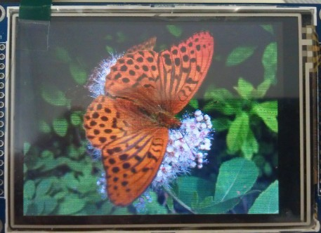

Source image:

[Storage data file *.xml.](image-butterfly21.f4c10f0c.xml).

Result "C" source file for [monochrome](image-butterfly2-mono.acfd92f7.zip) and [color](image-butterfly2-color.4347b07e.zip) display.

Image on monochrome LCD 320x240 (BP320240E):

Image on color LCD 320x240 R5G6B5? (YX32B):

