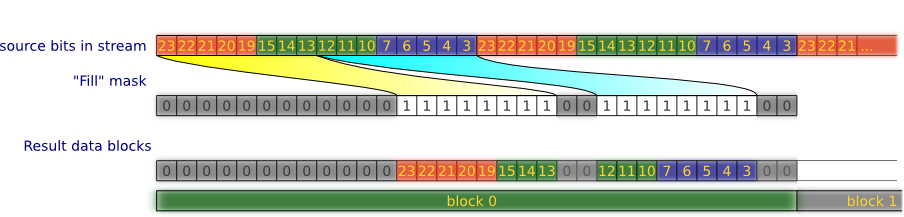

Settings to copy source image bits to output data blocks.

# Step 1

Prepare source image data. Each pixel of image converted to integer value, equals to RGB.

  *  For monochrome type all bits of this value sets to 1 or 0.
  
  *  For grayscale, "gray value" calculated by [qGray](http://qt-project.org/doc/qt-4.8/qcolor.html#qGray-2), and each field R, G, B replaced by "gray value".
  
  *  Color image stays unchanged.
  

As result we have data array, what later processed by masks.

#Step 2

Processing data array with masks "AND", "OR" and operations of selection/shifting.
Each operation selects bits and shifts its to desired direction.
Results of this combined by "OR".
So, each bit of source value can be copied to any position of output value.
As finished, output value is combined with 2 masks:

  *  First, mask «AND», allows reset specified bits to 0;
  *  Second, «OR», allows set specified bits to 1.

# Step 3

Building bit stream from data array, to pack its to data blocks later. After processing the image data points are a set of 32-bit integer values, each of which corresponds to a single pixel. Write a mask "Used" to specify which bits of the above value include to the stream of bits for packing.

*Note: mask "Used" cannot be empty, at least one bit must be set.*

# Step 4

Packaging data is always enabled, regardless of the size of the data block.
Initial data for the packing is a stream of bits.
Packing goes row-by-row, that is, begins anew for each new row of image.

Write "Fill" mask, which is a 32-bit integer.
The mask indicates which bits in the output data block will be (1) filled in by data from the bit stream, and which are skipped (0).

For example, if we are using uint32_t as blocks of data, but we want to used only the low byte of, the mask should be equal to 0x000000ff.

This feature can be used to shifting bits of information to any position of the output data block.

Then process the bit stream through the mask to fill the output blocks by bits of the image.

*Note: "Fill" mask can't be empty (0x00000000), because this produces infinity loop of packing.*

([gif](algorithm-6.gif))

# Step 5

Changing the order of bytes from a Little-Endian to Big-Endian, if so specified in the settings.