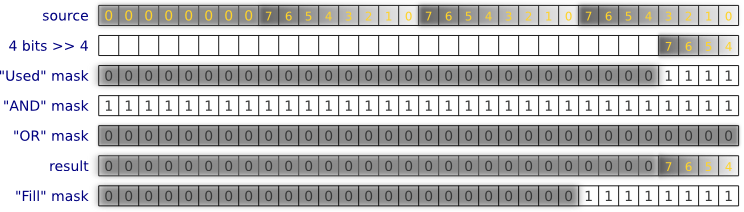
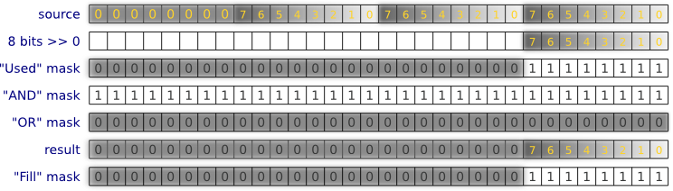

**Monochrome, 1 bit/pixel, 8 pixels at 1 byte**

**Monochrome, 1 bit/pixel, 32 pixels at 4 bytes (uint32_t)**

**Grayscale, 4 bits/pixel, 2 pixels at 1 byte**

**Grayscale, 8 bits/pixel, 1 pixel at 1 byte**

**Color, 16 bits/pixel, B5G6R5?, 1 pixel at 2 bytes (uint16_t)**

**Color, 16 bit/pixel, R5G6B5?, 1 pixel at 2 bytes (uint16_t)**
