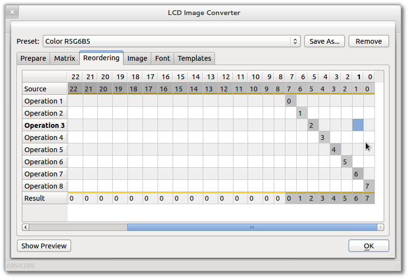

Reordering of bits in the output data blocks may be needed in some particular cases.

Configuration is performed in a table containing the shift operations. Adding and removing shift operations fully like [Conversion - Matrix](./matrix/).

