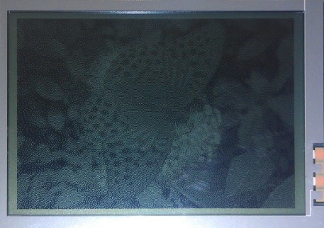

Исходное изображение:

[Файл данных *.xml](image-butterfly21.f4c10f0c.xml).

Получившийся файл "C" для [монохромного](image-butterfly2-mono.acfd92f7.zip) и [цветного](image-butterfly2-color.4347b07e.zip) дисплеев.

Изображение на монохромном LCD 320x240 (BP320240E):

Изображение на цветном LCD 320x240 R5G6B5 (YX32B):

