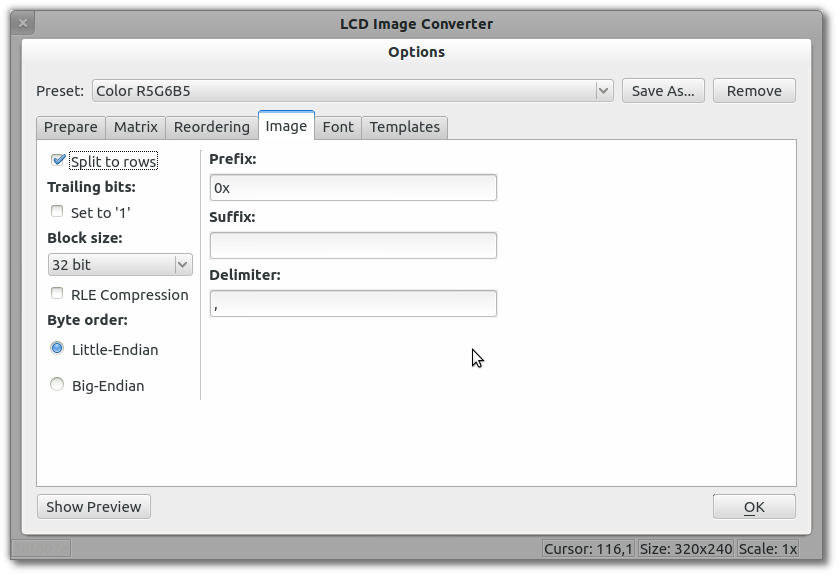

  *  Разбивать данные на строки;
  *  Блок данных:
      *    8 бит;
      *    16 бит;
      *    24 бита;
      *    32 бита;
      *    теоретически можно расширить до 64 бит, но работать будет совсем неудобно;
  *  Сжатие RLE;
  *  Порядок байт, Little-Endian или Big-Endian;
  *  Завершающие биты - биты в блоках данных, не относящиеся к самому исходному изображению;
  *  Префикс, Суффикс, Разделитель - параметры перевода блоков данных в строку.

