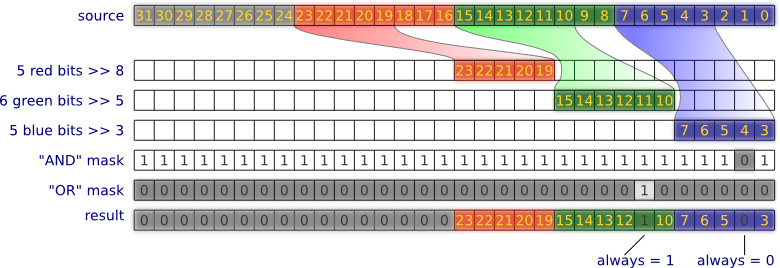

Настройка расположения битов исходного изображения в блоках выходных данных.

# Шаг 1

Обработка исходного изображения. Каждая точка изображения переводится в целое число, соответствующее значению RGB.

  *  Если выбран монохромный режим, все биты этого числа устанавливаются в 0, либо в 1.
  
  *  Если выбран режим градаций серого, функцией [qGray](http://qt-project.org/doc/qt-4.8/qcolor.html#qGray-2) вычисляется значение серого, и каждое из полей RGB заменяется на значение серого.
  
  *  Цветное изображение не изменяется.
  

В результате получается массив данных, далее обрабатываемый масками.

# Шаг 2

Обработка собранных данных изображения с помощью масок «AND», «OR» и операциями сдвига битов. Каждая операция состоит из выбора битов маской и их сдвига в нужную сторону. Результаты выбора и сдвига складываются логическим «ИЛИ». Таким образом, можно любой бит исходного значения переместить в любую позицию выходного значения. По завершении всех операций, на выходное значение накладываются последовательно две маски:

  *  Первая, маска «AND», позволяет сбросить указанные биты данных в 0 с помощью операции логического «И»;
  *  Вторая, «OR», позволяет установить указанные биты данных в 1 логическим «ИЛИ».

# Шаг 3

Выстраивание обработанных данных изображения в последовательный поток бит, для дальнейшей упаковки. После обработки точек изображения данные представляют собой набор 32-разрядных целых чисел, каждое из которых соответствует одной точке. Записываем маску «Used», для указания того, какие биты вышеуказанных чисел включать в поток битов для упаковки.

*Примечание: маска «Used» не может быть пустой (0x00000000), должен быть установлен как минимум 1 бит.*

# Шаг 4

Упаковка данных производится всегда, независимо от размеров блока данных. Исходные данные для упаковки содержат обработанные биты каждой точки изображения, выстроенные в один сплошной поток битов. Упаковка построчная, т.е. начинается заново для каждой новой строки изображения.

Записываем маску «Fill», представляющую собой 32-разрядное число. Данная маска указывает, какие биты в выходном блоке данных будут заполнены (1) информацией из потока бит, а какие пропущены (0).

Например, если используем uint32_t в качестве блоков данных, но при этом хотим, чтобы использовался лишь младший байт, то маска должна быть равна 0x000000ff.

Это можно применять для смещения битов информации в любое место блока данных.

Далее пропускаем поток бит через эту маску для заполнения выходных блоков данных битами изображения.

*Примечание: маска «Fill» не может быть пустой (0x00000000), так как это приведёт в бесконечному циклу упаковки данных.*

([gif](algorithm-6.gif))

# Шаг 5

Смена порядка байт с Little-Endian на Big-Endian, если это было указано в настройках.