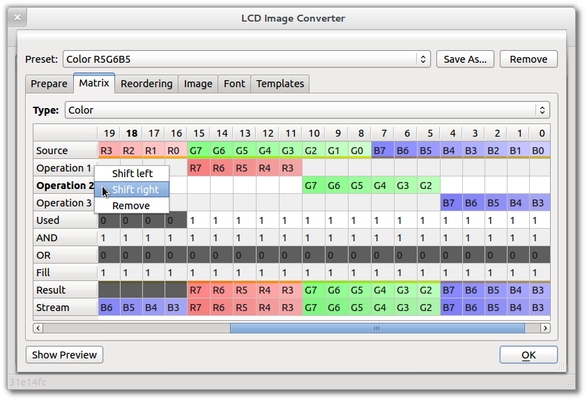
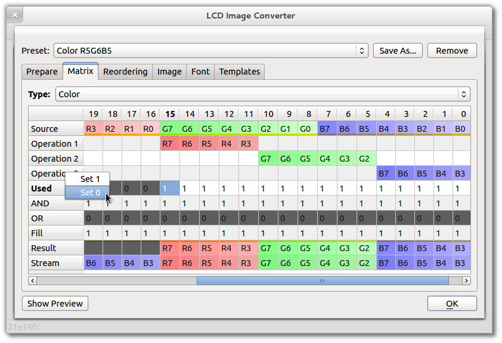

Settings to copy source image bits to output data blocks. Configuration is performed in a table containing the shift operations and a masks.

To add a new operation "selection/shift", select the desired bits of source value with the help of a keyboard or mouse, and open the context menu. There, you can specify for how the number of bits, and in which direction to shift the selected bits.

Move or delete the existing operation is possible from its context menu.

Masks "Used", "AND", "OR", "Fill" edited manually by entering "1" or "0" bit fields, or from the its context menu.

