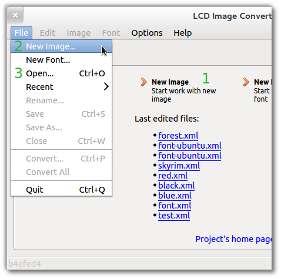
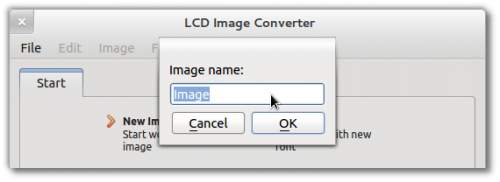

Для создания нового изображения вы можете:

  1.  Нажать кнопку Новое изображение... на стартовой странице;
  2.  Открыть меню Файл -> Новое изображение ...;
  3.  Открыть меню Файл -> Открыть..., выбрать фильтр Файлы изображений, открыть существующий файл одного из поддерживаемого форматов.

Затем нужно ввести имя создаваемого изображения. Это имя будет затем использовано при преобразовании в формат "C", как имя структуры данных.

