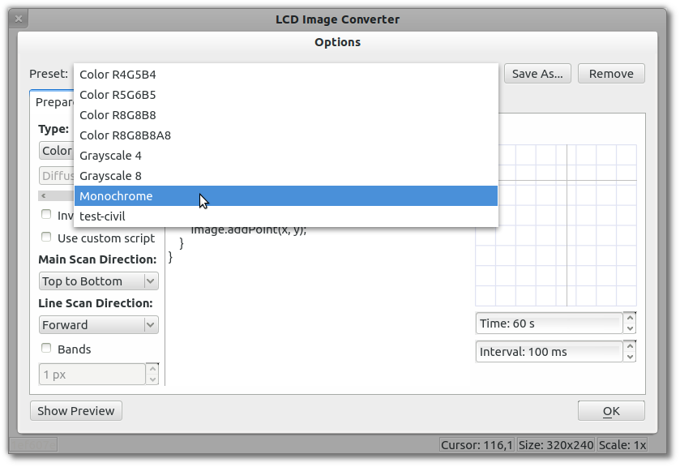

Все настройки преобразования объединены в заготовки. Это позволяет переключать их одновременно, например, при смене проекта или дисплея.

Для создания новой заготовки следует:

  *  Выбрать из существующих наиболее подходящую;
  *  Изменить параметры заготовки;
  *  Сохранить под новым именем.

При удалении всех существующих заготовок приложение воссоздаст набор заготовок по умолчанию, при следующем открытии окна настроек.

По кнопке **Открыть предпросмотр** выводится окно с примером преобразования изображения в текст, учитывая текущие настройки. 

