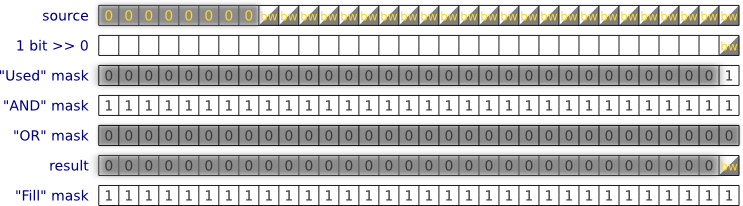

**Монохромное, 1 бит/точку, 8 точек в одном байте**

**Монохромное, 1 бит/точку, 32 точки в четырёх байтах (uint32_t)**

**Градации серого, 4 бита/точку, 2 точки в одном байте**

**Градации серого, 8 бит/точку, 1 точка в одном байте**

**Цветное, 16 бит/точку, B5G6R5?, 1 точка в двух байтах (uint16_t)**

**Цветное, 16 бит/точку, R5G6B5?, 1 точка в двух байтах (uint16_t)**
