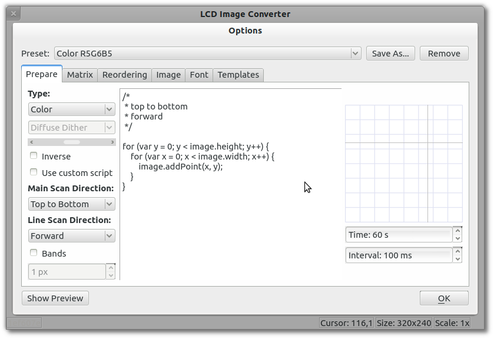

Здесь указываются операции, предшествующие переводу изображения в текстовый вид.

Каждое изображение по умолчанию считается цветным и хранится как цветное. Данное преобразование позволяет изменить тип изображения перед его обработкой:

  *  Монохромное;
  *  Edge;
  *  Пороговое значение;
  *  Diffuse Dither;
  *  Ordered Dither;
  *  Threshold Dither;
  *  Градации серого (функция [qGray](http://qt-project.org/doc/qt-4.8/qcolor.html#qGray-2));
  *  Цветное (оставить без изменения);

Также можно инвертировать цвета.

Порядок обхода точек изображения при сканировании определяется скриптом. Предусмотрено 16 заготовок скриптов. Также, можно применить собственный скрипт сканирования на основе наиболее подходящего из предложенных.

В правой части окна выводится простая анимация, изображающая порядок обхода точек при указанном скрипте. Параметры времени определяют общий период анимации и интервал обновления.

Дополнительно, возможно задать сканирование полосами, что может быть удобно для некоторых LCD с опрелелённым распределением памяти.

Например, последовательность сканирования:

Для дисплея с такой памятью:

